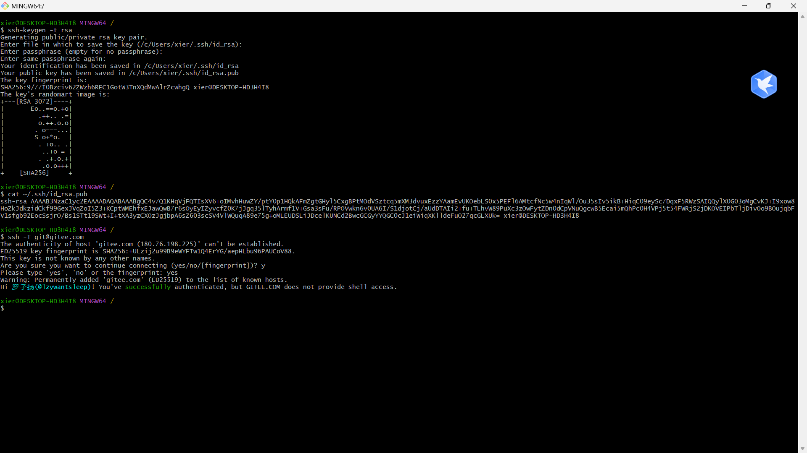
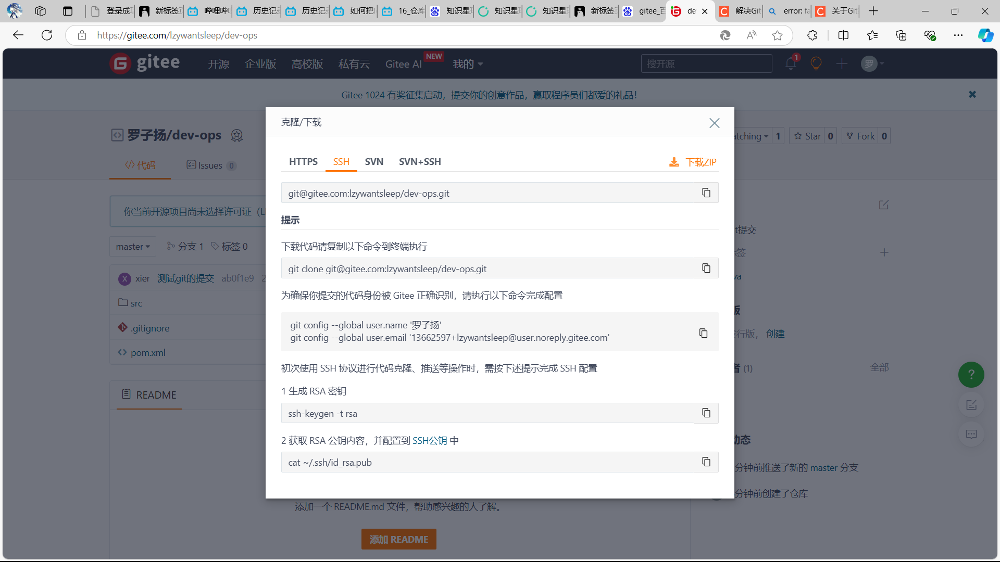
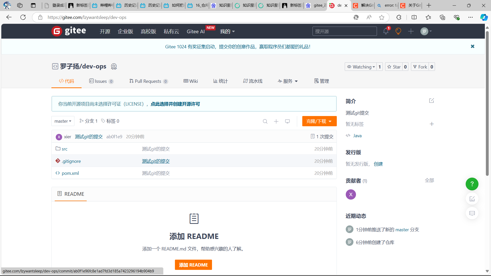

1.首先要**配置好本地window的git环境**，还有**idea的setting**指定git.exe的目录

2.我们这里**使用ssh的方式和远程仓库互动**，因为ssh不需要和https一样每次都要输入用户名和密码进行校验。

3.但是我们在使用ssh和远程仓库进行互动之前，要先在远程仓库对应的**gitee账户上添加我们电脑的密钥**，这样才能防止什么人都能随便push远程代码。

**配置密钥方式：**

在git-bash中生成我们电脑的git密钥，然后cat一下复制我们的密钥，然后在远程仓库所在的账户的个人中心中添加ssh密钥就行。

4.**建立远程仓库（**如果有远程仓库我们就直接git clone到本地就行），**注意在创建远程仓库的时候尽量不要初始化**，保持仓库的干净，因为本地仓库在要和远程仓库保持一致。（也就是远程仓库有的东西，本地也要有，比如会冲突，如果你执行了什么初始化然后远程仓库有的文件我们本地没有了就没办法push了）

5.在我们的项目中创建本地仓库（如果项目没有本地仓库的话），一般你点那个idea左下角那个git分支，如果没有本地仓库他会显示让你创建本地仓库，有了本地仓库后我们就可以进行远程代码的提交了。

6.我们右键选择**git->commit files**,然后勾选我们要提交的代码，写一下注释（amend不用勾），然后commit(或者commit and push

),然后右键**git -> push**进行代码提交，然后他会弹出让我们去配置git的远程代码仓库连接，我们复制这里的ssh连接：

7.拉取代码成功：
