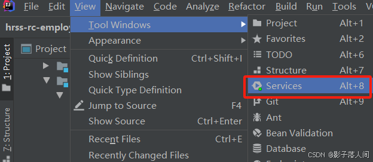
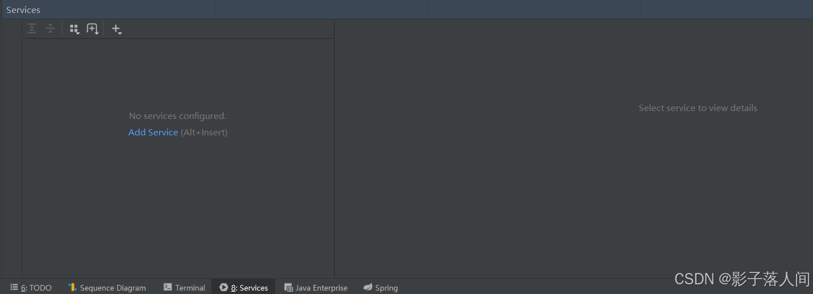
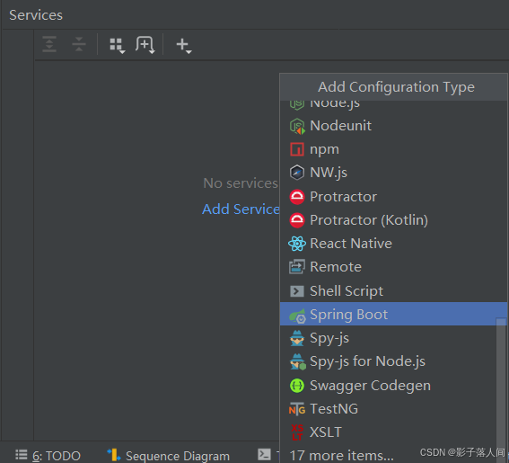
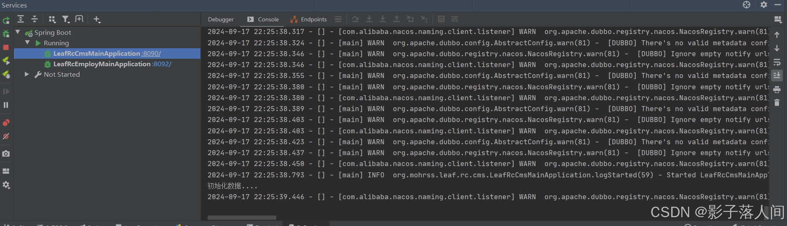

在多数情况下，通常会打开一个项目，里面有多个项目需要运行，这里教大家怎么开启多个窗口来查看项目运行状态，最终效果如下。

点击**view -> Tool Windows-> Services**

点击**services**之后，会在下面出现这个页面。

点击**Add Service -> Run Configuration Type**，选择**SpringBoot**

之后直接运行项目，就会实现最终效果。
