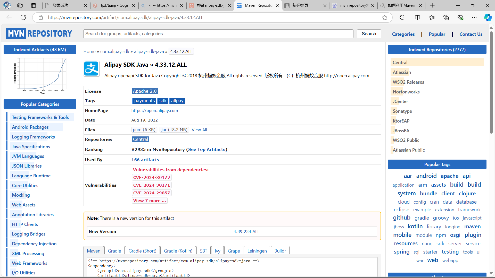

今天在写项目的时候遇到：

阿里支付的jar包一直无法maven远程拉取，一开始以为是版本冲突问题，后面换了好几个版本都无法搞，最后被迫去寻找别的办法。

**解决办法：**

我们可以通过下载对应版本的jar包到本地，然后通过cmd将jar包拉取到本地仓库

**操作：**

1.先去mvn repository找到对应的依赖jar包

2.点击那个files->jar将jar包下载下来

3.将jar包放在指定位置，mvn默认路径为c:/用户（users）/用户名里面找对应jar包，我们一般放那里就行

4.执行命令拉取到本地仓库：

```
mvn install:install-file -DgroupId=com.alipay.sdk -DartifactId=alipay-sdk-java -Dversion=4.33.12.ALL -Dpackaging=jar -Dfile=alipay-sdk-java-4.33.12.ALL.jar
```

附上命令解释：

```
<!-- https://mvnrepository.com/artifact/com.alipay.sdk/alipay-sdk-java -->
<dependency>
    <groupId>com.alipay.sdk</groupId>
    <artifactId>alipay-sdk-java</artifactId>
    <version>4.33.12.ALL</version>
</dependency>

根据依赖拼接命令行，-DgroupId就是上面的<groupid>,-DartifactId就是上面的<artifacted>,-Dversion就是上面的<version>,
-DFile=就是jar包名字
```

